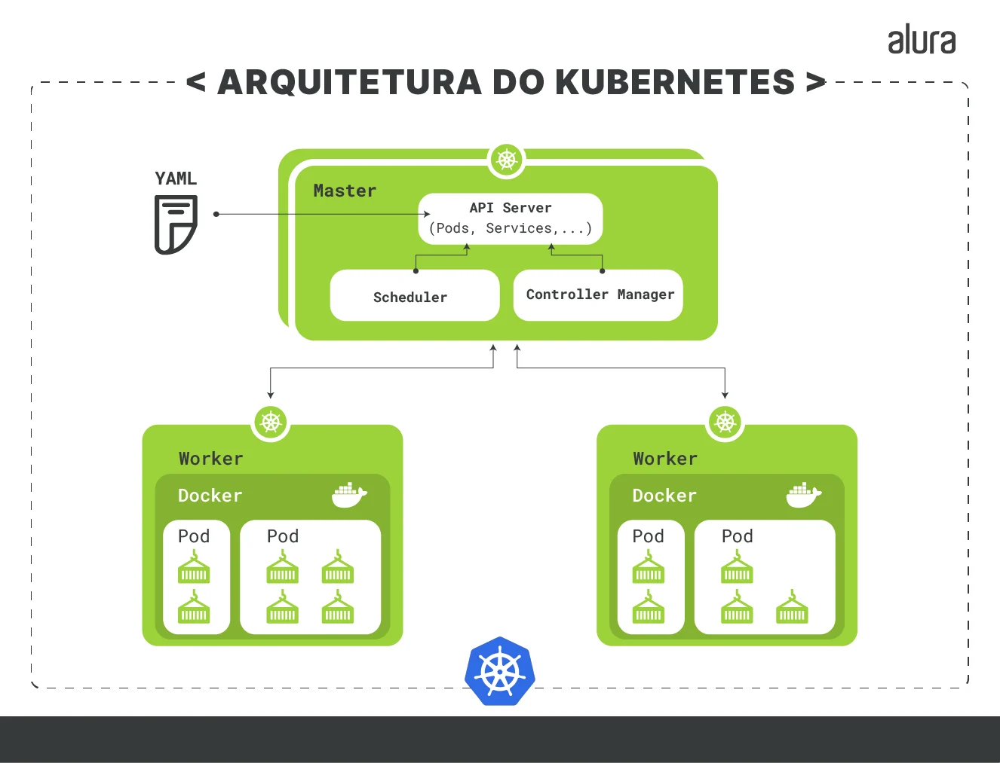
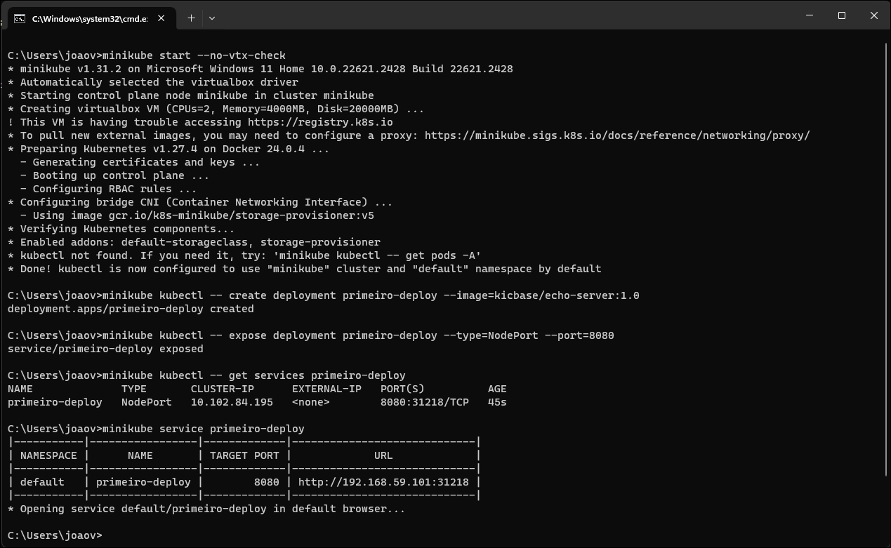
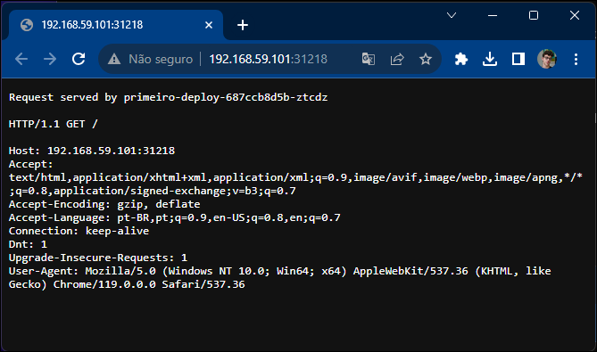
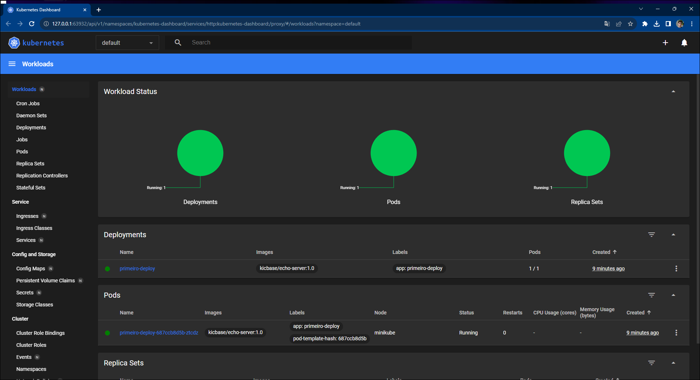

# Orquestração de Containers utilizando Kubernetes
Trabalho prático da Disciplina de Laboratório de Engenharia de Software do curso de Engenharia de Computação do CEFET-MG

### Integrantes:

- Fabricio Augusto
- Ivia Marques
- João Victor Peluci
- Luis Felipe Lopes
---

## Embasamento teórico
### Kubernetes
#### O que é?
Kubernetes é um sistema de código-aberto desenvolvido pela Google que possibilita a realização de Orquestração de Containers para automação da implementação, a gestão e a escalabilidade de aplicações mantidas dentro de containers.

|  | 
|:--:| 
| *Arquitetura de Kubernetes - Créditos: Alura* |


#### Clusteres
Um sistema ativo de Kubernetes é dividido em unidades chamadas de Clusteres, grupos de containeres rodando o sistema operacional Linux®.

#### Casos de uso
Pode ser usado para implantar e escalar
1. Sistemas Web e Aplicativos
2. Bancos de dados, sistemas de análise e processamento de dados em tempo real.
3. Modelos de aprendizado de máquina.
4. Dispositivos IoT.

#### Como funciona
Ao usar o Kubernetes, temos um cluster dividido em um master que gerencia e mantém o cluster e temos os nós trabalhalhadores (workers), que executam a aplicação.

## Funcionamento prático
### Ferramentas utilizadas
1. Minikube: uma Kubernetes local, utilizada para finalidades de ensino. 
2. Oracle VirtualBox: para virtualização das máquinas.

### Configurando  as ferramentas
Para simular esse roteiro, foi utilizado uma máquina com Windows 11.

1. Instalar o **Minikube** usando a [documentação online](https://minikube.sigs.k8s.io/docs/start/).
2. Instalar a **VirtualBox** usando os passos da [documentação online](https://www.virtualbox.org/).

### Testando o ambiente
Após configuração inicial:
#### Inicializar o Cluster do Minikube
<code> minikube start </code>

### Fazer Deploy de uma aplicação
<code>minikube kubectl -- create deployment primeiro-deploy --image=kicbase/echo-server:1.0
</code>

### Expor a aplicação
<code>minikube kubectl -- expose deployment primeiro-deploy --type=NodePort --port=8080</code>

### Obter dados do funcionamento do deploy
<code>minikube kubectl -- get services primeiro-deploy</code>

### Acessar a aplicação
<code>minikube service primeiro-deploy</code>

|  | 
|:--:| 
| Execução dos comandos no terminal |


|  | 
|:--:| 
| Aplicação em funcionamento local |

### Acessar a Dashboard do Kubernetes 

<code>minikube dashboard</code>

|  | 
|:--:| 
| Dashboard Kubernetes |

### Deploy de uma aplicação em PHP com Kubernetes
1. Inicia-se criando um diretório denominado "definitions" para acomodar as definições de objetos do Kubernetes, o que é crucial para o gerenciamento da aplicação no cluster.
2. Desenvolve-se um arquivo YAML chamado php_service.yaml para configurar um serviço no Kubernetes denominado "php". Este serviço age como um ponto de entrada para o PHP-FPM, e sua função é essencialmente rotear o tráfego para a aplicação PHP.

```yaml
apiVersion: v1
kind: Service
metadata:
  name: php
  labels:
    tier: backend
spec:
  selector:
    app: php
    tier: backend
  ports:
  - protocol: TCP
    port: 9000
```
    
3. Utiliza-se o comando kubectl apply para efetivamente implantar o serviço PHP-FPM no cluster Kubernetes.
4. Para garantir a correta implantação, realiza-se uma verificação executando o comando kubectl get svc, que fornece informações sobre o status do serviço PHP-FPM.
5. Um segundo arquivo YAML, chamado nginx_service.yaml, é criado para definir outro serviço no Kubernetes denominado "nginx". Esse serviço atua como um ponto de acesso para o servidor Nginx.

```yaml
apiVersion: v1
kind: Service
metadata:
  name: nginx
  labels:
    tier: backend
spec:
  selector:
    app: nginx
    tier: backend
  ports:
  - protocol: TCP
    port: 80
  externalIPs:
  - seu_ip_público
```
  
6. Utiliza-se o comando kubectl apply novamente, desta vez para implantar o serviço Nginx no cluster Kubernetes.
7. Executa-se o comando kubectl get svc mais uma vez para verificar o status do serviço Nginx e obter informações relevantes sobre ele.

Está criado os serviços PHP-FPM e o Nginx.

Agora iremos fazer um deployment PHP-FPM

1. Arquivo YAML chamado php_deployment.yaml que especifica como os pods do PHP-FPM devem ser criados e mantidos.

```yaml
apiVersion: apps/v1
kind: Deployment
metadata:
  name: php
  labels:
    tier: backend
spec:
  replicas: 1
  selector:
    matchLabels:
      app: php
      tier: backend
  template:
    metadata:
      labels:
        app: php
        tier: backend
    spec:
      volumes:
      - name: code
        persistentVolumeClaim:
          claimName: code
      containers:
      - name: php
        image: php:7-fpm
        volumeMounts:
        - name: code
          mountPath: /code
      initContainers:
      - name: install
        image: busybox
        volumeMounts:
        - name: code
          mountPath: /code
        command:
        - wget
        - "-O"
        - "/code/index.php"
        - https://raw.githubusercontent.com/do-community/php-kubernetes/master/index.php
```
        
2. Definiu o número de réplicas (instâncias) que o Deployment deve manter, neste caso, 1 réplica.
3. Especificou a imagem do contêiner PHP a ser usada, que é php:7-fpm. Este contêiner será responsável por executar o código PHP de sua aplicação.
4. Definiu um volume chamado code que representa o código da aplicação. Este volume é associado a um PersistentVolumeClaim (PVC) chamado code. Os containers podem acessar esse volume para ler e gravar arquivos.
5. Configurou um Init Container chamado install que é executado antes dos containers regulares. Este Init Container é responsável por baixar o código da aplicação a partir do GitHub e colocá-lo no volume code.
6.  Usou o comando kubectl apply para criar o Deployment no cluster Kubernetes.
7.  Verificou o estado do Deployment e dos pods criados usando comandos kubectl get.

Agora iremos fazer um deployment Nginx

1. Arquivo YAML chamado nginx_configMap.yaml para criar um ConfigMap chamado nginx-config. Este ConfigMap contém a configuração do servidor Nginx no formato chave-valor.

```yaml
apiVersion: v1
kind: ConfigMap
metadata:
  name: nginx-config
  labels:
    tier: backend
data:
  config : |
    server {
      index index.php index.html;
      error_log  /var/log/nginx/error.log;
      access_log /var/log/nginx/access.log;
      root /code
      
      location / {
          try_files $uri $uri/ /index.php?$query_string;
      }

      location ~ \.php$ {
          try_files $uri =404;
          fastcgi_split_path_info ^(.+\.php)(/.+)$;
          fastcgi_pass php:9000;
          fastcgi_index index.php;
          include fastcgi_params;
          fastcgi_param SCRIPT_FILENAME $document_root$fastcgi_script_name;
          fastcgi_param PATH_INFO $fastcgi_path_info;
        }
    }
```
    
2. No ConfigMap, você especificou a configuração do Nginx, incluindo diretivas do servidor, logs, raiz do diretório e configuração para lidar com solicitações PHP. Essa configuração será usada pelos pods do Nginx.
3. Usando o comando kubectl apply, você criou o ConfigMap no cluster Kubernetes, permitindo que ele seja referenciado em outros objetos.
4. Arquivo YAML chamado nginx_deployment.yaml para criar o Deployment do Nginx. O Deployment é responsável por gerenciar os pods Nginx.

```yaml
apiVersion: apps/v1
kind: Deployment
metadata:
  name: nginx
  labels:
    tier: backend
spec:
  replicas: 1
  selector:
    matchLabels:
      app: nginx
      tier: backend
  template:
    metadata:
      labels:
        app: nginx
        tier: backend
    spec:
      volumes:
      - name: code
        persistentVolumeClaim:
          claimName: code
      - name: config
        configMap:
          name: nginx-config
          items:
          - key: config
            path: site.conf
      containers:
      - name: nginx
        image: nginx:1.7.9
        ports:
        - containerPort: 80
        volumeMounts:
        - name: code
          mountPath: /code
        - name: config
          mountPath: /etc/nginx/conf.d
```
          
5. No arquivo de Deployment, você definiu a imagem do contêiner Nginx, a porta e o número de réplicas desejadas.
6. Os pods do Nginx receberam acesso ao volume que armazena o código da aplicação (PVC code) e ao ConfigMap nginx-config.
7. O ConfigMap foi montado no diretório de configuração do Nginx, permitindo que o Nginx utilize a configuração definida no ConfigMap.
8. Usando kubectl apply, você criou o Deployment do Nginx no cluster Kubernetes.

Finalmente, está pronto o seu deployment de uma aplicação PHP com Kubernetes

## Referências
1. [**O que é orquestração de containers?**, Red Hat Website
](https://www.redhat.com/pt-br/topics/containers/what-is-container-orchestration).
2. [**Orquestração de containers: o que é e como fazer** - Escola Superior de Redes](https://esr.rnp.br/administracao-de-sistemas/orquestracao-containers-como-fazer/).
3. [**Kubernetes: conhecendo a orquestração de containers** - Alura, Paulo Calanca](https://www.alura.com.br/artigos/kubernetes-conhecendo-orquestracao-containers).
4. [**Minikube: Documentação Online**](https://minikube.sigs.k8s.io/docs/start/).
5. [**VirtualBox: Documentação Online**](https://www.virtualbox.org/).
