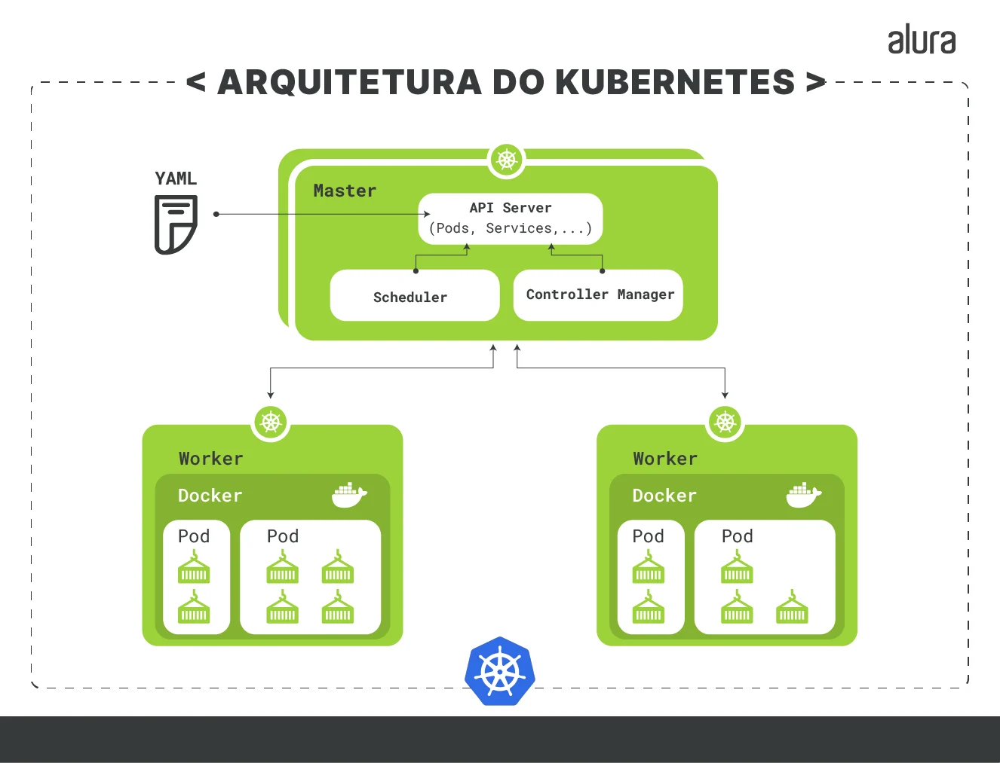
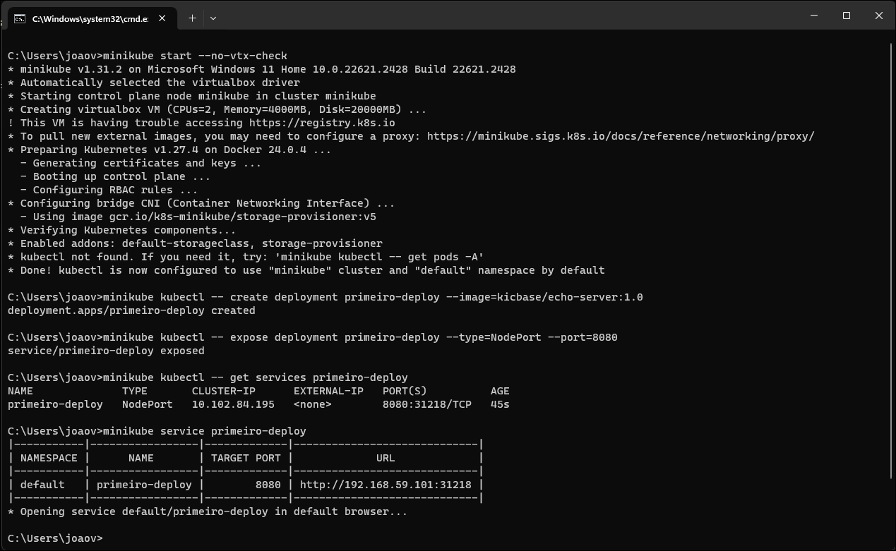
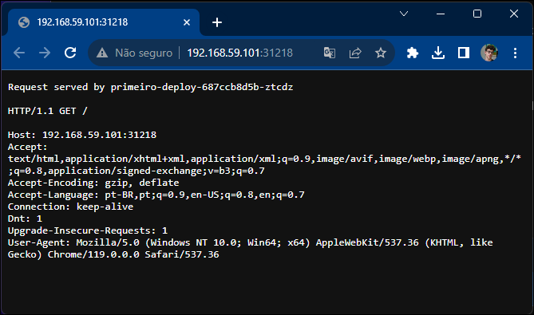
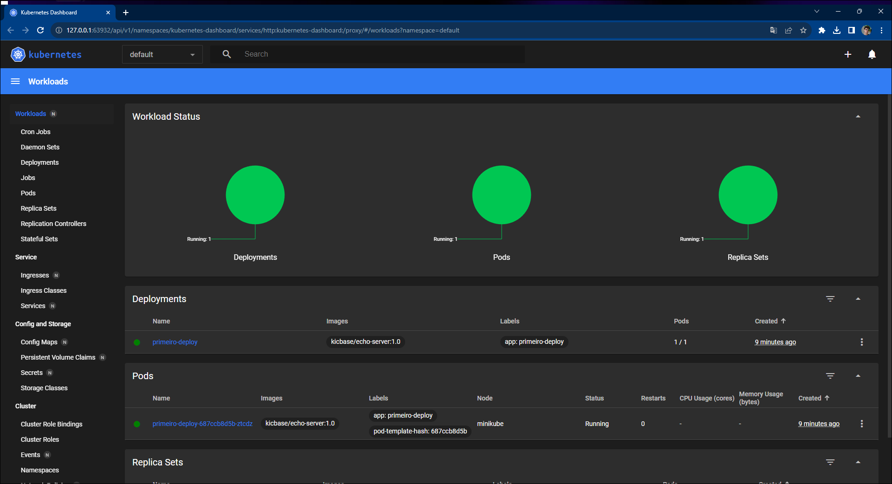

# Orquestração de Containers utilizando Kubernetes
Trabalho prático da Disciplina de Laboratório de Engenharia de Software do curso de Engenharia de Computação do CEFET-MG

### Integrantes:

- Fabricio Augusto
- Ivia Marques
- João Victor Peluci
- Luis Felipe Lopes
---

## Embasamento teórico
### Kubernetes
#### O que é?
Kubernetes é um sistema de código-aberto desenvolvido pela Google que possibilita a realização de Orquestração de Containers para automação da implementação, a gestão e a escalabilidade de aplicações mantidas dentro de containers.

|  | 
|:--:| 
| *Arquitetura de Kubernetes - Créditos: Alura* |

#### Clusteres
Um sistema ativo de Kubernetes é dividido em unidades chamadas de Clusteres, grupos de containeres rodando o sistema operacional Linux®.

#### Casos de uso
Pode ser usado para implantar e escalar
1. Sistemas Web e Aplicativos
2. Bancos de dados, sistemas de análise e processamento de dados em tempo real.
3. Modelos de aprendizado de máquina.
4. Dispositivos IoT.

#### Como funciona
Ao usar o Kubernetes, temos um cluster dividido em um master que gerencia e mantém o cluster e temos os nós trabalhalhadores (workers), que executam a aplicação.

## Funcionamento prático
### Ferramentas utilizadas
1. Minikube: uma Kubernetes local, utilizada para finalidades de ensino. 
2. Oracle VirtualBox: para virtualização das máquinas.

### Configurando  as ferramentas
Para simular esse roteiro, foi utilizado uma máquina com Windows 11.

1. Instalar o **Minikube** usando a [documentação online](https://minikube.sigs.k8s.io/docs/start/).
2. Instalar a **VirtualBox** usando os passos da [documentação online](https://www.virtualbox.org/).

### Testando o ambiente
Após configuração inicial:
#### Inicializar o Cluster do Minikube
<code> minikube start </code>

### Fazer Deploy de uma aplicação
<code>minikube kubectl -- create deployment primeiro-deploy --image=kicbase/echo-server:1.0
</code>

### Expor a aplicação
<code>minikube kubectl -- expose deployment primeiro-deploy --type=NodePort --port=8080</code>

### Obter dados do funcionamento do deploy
<code>minikube kubectl -- get services primeiro-deploy</code>

### Acessar a aplicação
<code>minikube service primeiro-deploy</code>

|  | 
|:--:| 
| Execução dos comandos no terminal |

|  | 
|:--:| 
| Aplicação em funcionamento local |

### Acessar a Dashboard do Kubernetes 

<code>minikube dashboard</code>

|  | 
|:--:| 
| Dashboard Kubernetes |

## Referências
1. [**O que é orquestração de containers?**, Red Hat Website
](https://www.redhat.com/pt-br/topics/containers/what-is-container-orchestration).
2. [**Orquestração de containers: o que é e como fazer** - Escola Superior de Redes](https://esr.rnp.br/administracao-de-sistemas/orquestracao-containers-como-fazer/).
3. [**Kubernetes: conhecendo a orquestração de containers** - Alura, Paulo Calanca](https://www.alura.com.br/artigos/kubernetes-conhecendo-orquestracao-containers).
4. [**Minikube: Documentação Online**](https://minikube.sigs.k8s.io/docs/start/).
5. [**VirtualBox: Documentação Online**](https://www.virtualbox.org/).